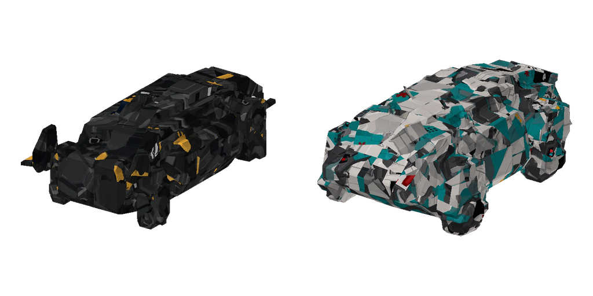

# Cyberpunk Hovercraft resource pack

This optional Minecraft 1.20.1 resource pack turns two existing Immersive
Aircraft vehicles into futuristic VTOL aircraft without changing the mod's Java
source:



| Resource-pack vehicle | Immersive Aircraft slot | Flight behavior |
| --- | --- | --- |
| Militech AV | Quadrocopter | Fuel-powered hover, vertical flight, strafing, and one weapon slot |
| Trauma Team Atlus | Cargo Airship | Fuel-powered hover, vertical/forward flight, two seats, and cargo storage |

Minecraft resource packs cannot register new entity or item IDs. Reusing these
two existing slots is what makes the aircraft work with an unmodified Immersive
Aircraft JAR. Recipes, controls, sounds, inventories, and saved-vehicle behavior
come from the respective base vehicles.

## Install

1. Build or install the `1.20.1` version of Immersive Aircraft.
2. Copy this `cyberpunk_hovercraft` directory into the Minecraft
   `resourcepacks` directory.
3. Enable **Militech AV + Trauma Team Atlus** above the default assets.
4. Craft or obtain a Quadrocopter for the Militech AV, and a Cargo Airship for
   the Trauma Team Atlus.

No datapack or modified mod JAR is required.

## Blockbench and source files

The editable sources are in [`source/`](source/). The original Meshy exports
contained roughly 1.96 million triangles per aircraft, which is too dense for
Blockbench and real-time entity rendering. The checked-in GLBs retain the source
UVs and textures but are reduced to about 6,800 triangles and 1024×1024 maps.
They import into Blockbench 5 as Generic Models.

Blockbench does not import glTF in its core editor. Install the community
[glTF Importer](https://github.com/JannisX11/blockbench-plugins/tree/master/plugins/gltf_importer)
from Blockbench's Plugins dialog, then use **File → Import → glTF Model** to
open either `.glb`. The generated `.bbmodel` files do not need that plugin and
open directly.

The runtime files in `assets/immersive_aircraft/objects/` are native Blockbench
`.bbmodel` projects. They can be opened directly in Blockbench. Immersive
Aircraft 1.20.1 accepts only four-vertex mesh faces, so the converter closes each
source triangle with one collinear vertex. That keeps the visible geometry
unchanged while satisfying the loader without a Java patch.

To regenerate a runtime model after editing an optimized GLB, export an
uncompressed GLB with its base-color UVs, save the base-color map as PNG, and
run:

```bash
node tools/glb_to_bbmodel.mjs \
  --input source/militech_av.glb \
  --output assets/immersive_aircraft/objects/quadrocopter.bbmodel \
  --texture assets/immersive_aircraft/textures/entity/militech_av.png \
  --texture-name militech_av.png \
  --length-blocks 4.5 \
  --forward-sign 1 \
  --name body
```

`tools/render_bbmodel.mjs` creates a transparent preview for visual checks and
requires `ffmpeg`:

```bash
node tools/render_bbmodel.mjs \
  --model assets/immersive_aircraft/objects/quadrocopter.bbmodel \
  --texture assets/immersive_aircraft/textures/entity/militech_av.png \
  --output /tmp/militech_av.png
```

## Asset provenance

The Militech AV and Trauma Team Atlus GLBs were supplied by the contributor for
this pack. They depict third-party fictional designs. No separate license grant
for those two assets is asserted here; confirm redistribution rights before
publishing or merging them.
